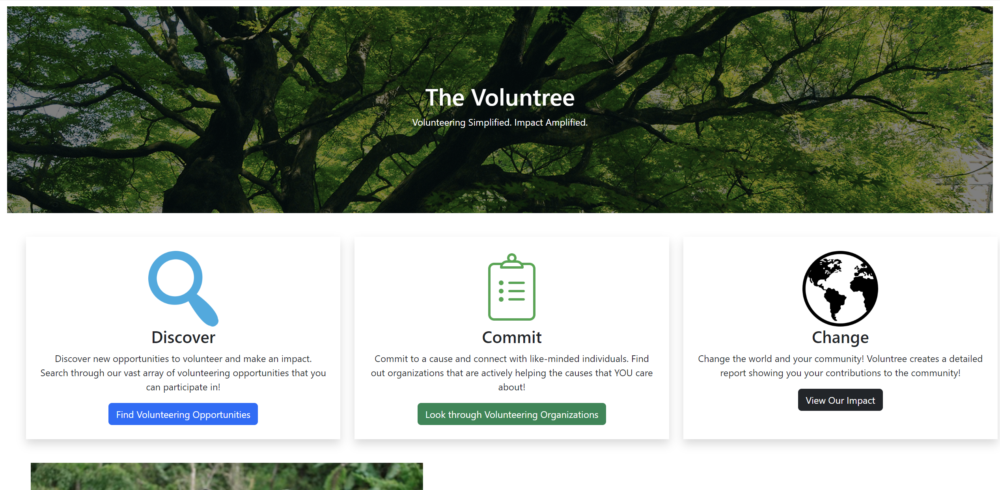
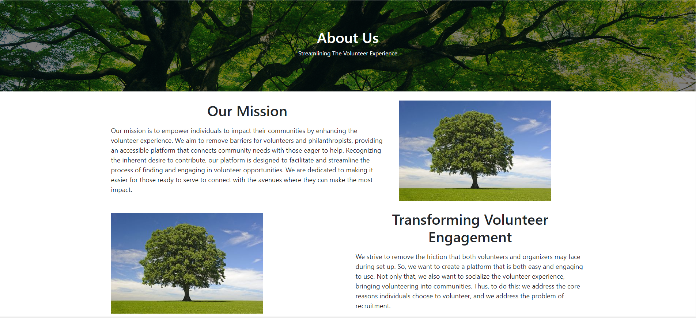
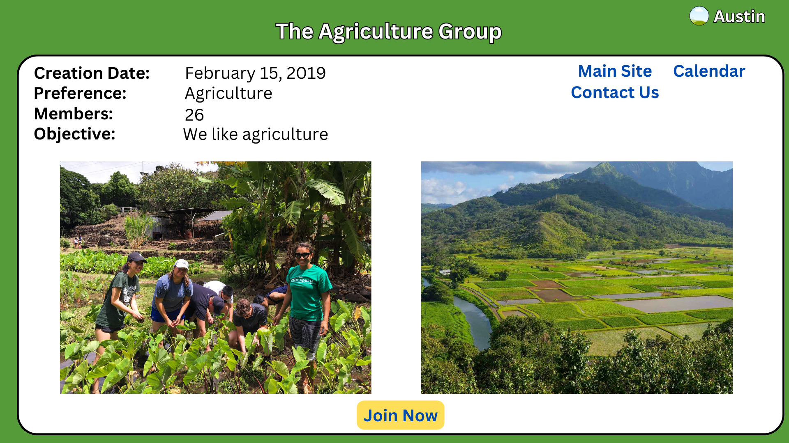
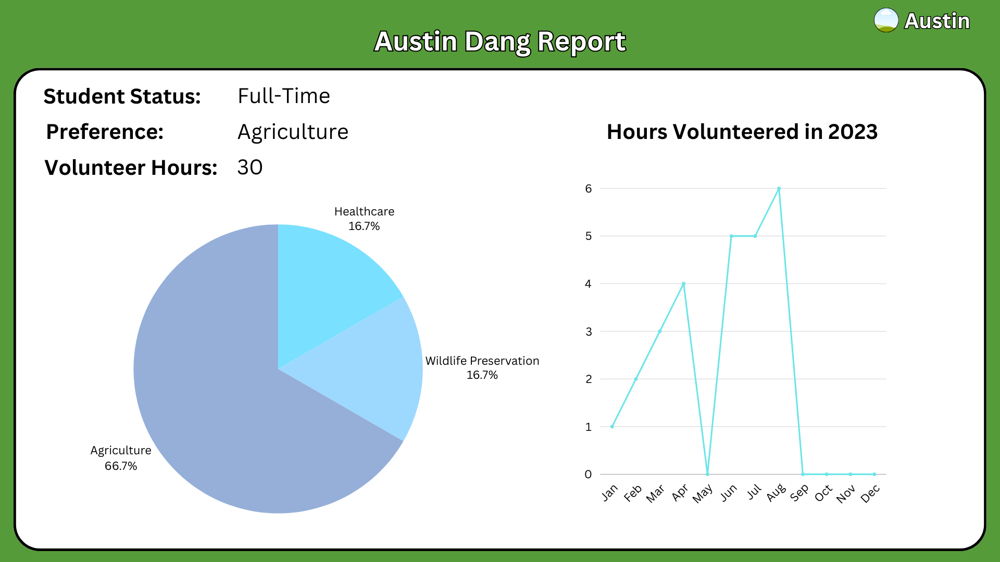

# Volunthree

## Table of contents

* [Overview](#overview)
* [Team](#team)

## Overview

Volunthree is a web application developed for Sara Kenley as a project for our ICS 414 course taught by Cam Moore.

[M1](https://github.com/orgs/volunthree/projects/1/views/1)

## Team

Volunthree is designed, implemented, and maintained by:
- [Kenji Sanehira](https://github.com/sanehirakenji)
- [Joshua Galeria](https://github.com/jgaleria)
- [Ian Iwata](https://github.com/ian-lastname)
- [Tevin Takata](https://github.com/tevin-takata)
- [Kai Matsusaka](https://github.com/kairemUH)
- [Tyler Asato](https://github.com/tylerz1443)
- [Austin Dang](https://github.com/austindang67)

## Landing Page

<figure class="figure float-end ps-4">
    
</figure>

## About Us

<figure class="figure float-end ps-4">
    
</figure>

## Volunteer Group Page

<figure class="figure float-end ps-4">
    
</figure>

## Report Page

<figure class="figure float-end ps-4">
    
</figure>
